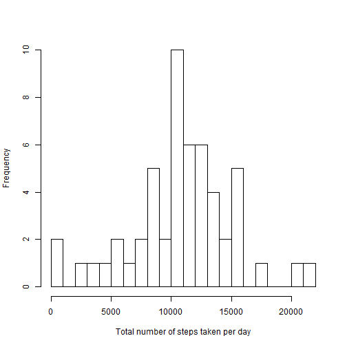
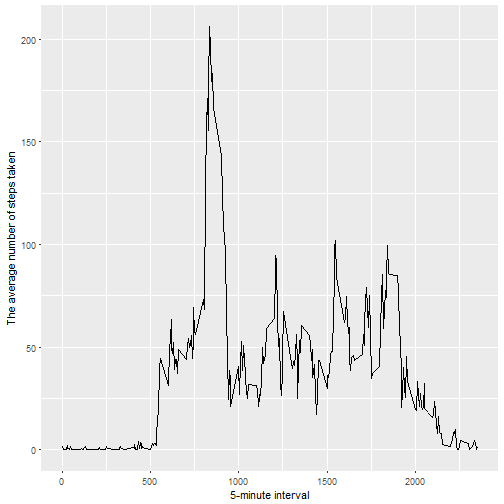
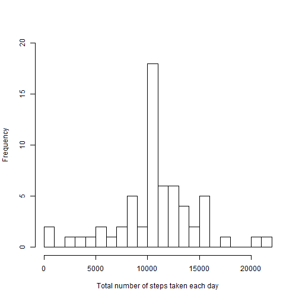
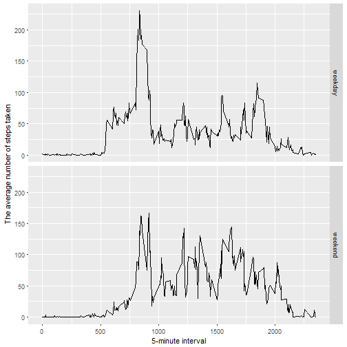

# Reproducible Research: Course Project 1

## Load packages

```r
library(ggplot2)
```

```
## Warning: package 'ggplot2' was built under R version 3.4.2
```

## Loading and preprocessing the data

```r
data <- read.csv("activity.csv")
str(data)
```

```
## 'data.frame':	17568 obs. of  3 variables:
##  $ steps   : int  NA NA NA NA NA NA NA NA NA NA ...
##  $ date    : Factor w/ 61 levels "2012-10-01","2012-10-02",..: 1 1 1 1 1 1 1 1 1 1 ...
##  $ interval: int  0 5 10 15 20 25 30 35 40 45 ...
```

```r
data$date <- as.Date(data$date)
data$interval <- as.factor(data$interval)
# Create a new factor variable in the dataset with two levels - "weekday" and "weekend"
# indicating whether a given date is a weekday or weekend day.
# sábado (Spanish) = Saturday (English); domingo (Spanish) = Sunday (English):
data$day <- as.factor(ifelse(weekdays(data$date) %in% c("sábado", "domingo"), "weekend", "weekday"))
summary(data)
```

```
##      steps             date               interval          day       
##  Min.   :  0.00   Min.   :2012-10-01   0      :   61   weekday:12960  
##  1st Qu.:  0.00   1st Qu.:2012-10-16   5      :   61   weekend: 4608  
##  Median :  0.00   Median :2012-10-31   10     :   61                  
##  Mean   : 37.38   Mean   :2012-10-31   15     :   61                  
##  3rd Qu.: 12.00   3rd Qu.:2012-11-15   20     :   61                  
##  Max.   :806.00   Max.   :2012-11-30   25     :   61                  
##  NA's   :2304                          (Other):17202
```

## What is mean total number of steps taken per day?

Calculate the total number of steps taken per day

```r
TotalSteps <- aggregate(steps ~ date, data, sum, na.action = na.pass)
# Alternative: TotalSteps <- tapply(data$steps, data$date, FUN = sum)
```

Make a histogram of the total number of steps taken each day

```r
hist(TotalSteps$steps, breaks = 20, main = NULL, xlab = "Total number of steps taken per day")
```



Calculate the mean and median of the total number of steps taken per day

```r
mean(TotalSteps$steps, na.rm = TRUE)
```

```
## [1] 10766.19
```

```r
median(TotalSteps$steps, na.rm = TRUE)
```

```
## [1] 10765
```

## What is the average daily activity pattern?

Make a time series plot of the 5-minute interval (x-axis) and the average number of steps taken,
averaged across all days (y-axis)

```r
avgs <- aggregate(steps ~ interval, data, mean)  # na.action = na.omit
ggplot(avgs, aes(as.integer(as.character(interval)), steps)) +
  geom_line() +
  xlab("5-minute interval") +
  ylab("The average number of steps taken")
```



Which 5-minute interval, on average across all the days in the dataset, contains the maximum number of steps?

```r
avgs[which.max(avgs$steps), ]
```

```
##     interval    steps
## 104      835 206.1698
```

## Imputing missing values

Note that there are a number of days/intervals where there are missing values (coded as `NA`).
The presence of missing days may introduce bias into some calculations or summaries of the data.

Calculate the total number of missing values in the dataset (i.e. the total number of rows with `NA`s)

```r
sum(is.na(data$steps))
```

```
## [1] 2304
```
Create a new dataset that is equal to the original dataset but with the missing data filled in.  
I use the mean for that 5-minute interval for filling in all of the missing values in the dataset.

```r
ImputedData <- data
index <- which(is.na(ImputedData$steps))
ImputedData[index, "steps"] <- avgs[as.numeric(ImputedData[index, "interval"]), "steps"]
```
Make a histogram of the total number of steps taken each day and calculate the mean and median total number of steps taken per day.

```r
TotalSteps <- aggregate(steps ~ date, ImputedData, sum)
hist(TotalSteps$steps, breaks = 20, main = NULL, ylim = c(0, 20), xlab = "Total number of steps taken each day")
```



```r
mean(TotalSteps$steps)
```

```
## [1] 10766.19
```

```r
median(TotalSteps$steps)
```

```
## [1] 10766.19
```

Do these values differ from the estimates from the first part of the assignment?

***The mean of the first and the second part are equal (10766.19).  
The median of the first part (10765) is different from the median of the second part (10766.19).***

What is the impact of imputing missing data on the estimates of the total daily number of steps?

***Median value is higher after imputing missing data.***

## Are there differences in activity patterns between weekdays and weekends?

Use the dataset with the filled-in missing values for this part.
Make a panel plot containing a time series plot of the 5-minute interval (x-axis) and the average number of steps taken,
averaged across all weekday days or weekend days (y-axis).

```r
avgs <- aggregate(steps ~ interval + day, ImputedData, mean)
ggplot(avgs, aes(as.integer(as.character(interval)), steps)) +
  geom_line() +
  facet_grid(day ~ .) +
  xlab("5-minute interval") +
  ylab("The average number of steps taken")
```


